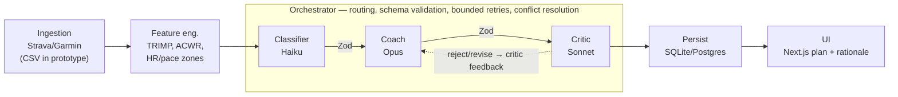

# CM3070 Computer Science Final Project — Draft Report

## Hyrox Personal Coach
### Multi-Model LLM Orchestration for Hybrid-Sport Training

**Iliass Jabali**
Student Number: 230586639
BSc Computer Science, University of London
Template: CM3020 Project Idea 1 — *Governing Multiple Models Around a Goal*

---

## Word Counts

| Chapter | Words | Limit |
|---|---:|---:|
| 1. Introduction | ~940 | 1000 |
| 2. Literature Review | ~1960 | 2500 |
| 3. System Design | ~1600 | 2000 |
| 4. Implementation | ~1220 | 2000 |
| 5. Evaluation | ~1970 | 2500 |
| 6. Conclusion | ~370 | 1000 |
| **Total** | **~8070** | **9500** |

*Counts are an approximate prose count (headers, captions, tables, code listings, figures, and references excluded), pending an exact `texcount -inc` pass on the LaTeX source. Each chapter is within its per-chapter limit and the total is within the strict 9500-word overall limit, with headroom remaining.*

## Contents

1. [Scope and Context](#1-scope-and-context)
2. [Review of Related Work](#2-review-of-related-work)
3. [System Design](#3-system-design)
4. [Implementation](#4-implementation)
5. [Evaluation](#5-evaluation)
6. [Conclusion](#6-conclusion)
7. [References](#references)
8. [Declaration of AI Use](#declaration-of-ai-use)

---

## 1. Scope and Context

### 1.1 Concept and contribution

This project designs a personal AI training companion for athletes competing in Hyrox, a hybrid-fitness race format that combines running with functional strength workouts. The system ingests an athlete's recent training history from their existing Strava and Garmin accounts, computes structured features such as heart-rate zones, training load, and acute-to-chronic workload ratio, and produces a next-session recommendation as schema-validated JSON. The reasoning is performed by three distinct pre-trained large language models, each used in a different prompted agent role: a small model classifies sessions, a large model generates coaching guidance, and a mid-size model critiques that guidance for plausibility and safety. A custom orchestrator, written in TypeScript and built directly on the Vercel AI SDK, handles routing, retries, and conflict resolution between agents. The technical contribution is not any single model but the deliberate orchestration discipline applied to a domain that has historically been served either by static plans or by single-model chat coaches.

### 1.2 Template and requirements

This project follows **CM3020 Project Idea 1: Multi-Model Orchestration for a Target Outcome**, operating across different domains or data spaces, into a single workflow that solves a well-specified problem. It explicitly does not require model training; the contribution is in model selection, integration, software engineering, and rigorous evaluation. The template flags that simply running models is not enough: markers expect evidence of testing, rejection, and substitution as part of the development process.

The present project meets these requirements as follows. Three pre-trained models are used: Anthropic's Claude Haiku, Claude Sonnet, and Claude Opus, each in a distinct prompted role. The three roles — classification, generation, and critique — operate over structurally different reasoning tasks even though the underlying data domain is shared. The integration is a custom TypeScript orchestrator built on the Vercel AI SDK, deliberately avoiding higher-level agent frameworks so that the orchestration logic itself constitutes the technical contribution. Schema validation between agents is enforced by Zod at runtime. Evaluation prioritises objective metrics — classifier accuracy, output consistency, and ablation studies — with a small user study as a supplementary signal, following direct guidance from the project supervisor.

### 1.3 Motivation and need

Hyrox is a hybrid-fitness race comprising 8 km of running interspersed : Featuring eight compound movement stations such as sled pushes, explosive burpees, and wall ball throws.It is currently among the fastest-growing fitness sports globally: reported participation grew roughly tenfold over the five years to 2024, and season-on-season figures show growth continuing, with the 2025/26 season projected to reach 1.5 million athletes across 105 races, up from around 570,000 athletes across 74 races the season before [1]. The athlete population is expanding rapidly while access to expert coaching has not kept pace.

Athletes currently choose between two unsatisfactory options: a generic static plan that ignores their data entirely, or a human coach at EUR 150–300 per month, inaccessible to most amateurs. Meanwhile their wearables already record everything a coach needs: heart-rate variability, sleep, load, pace, and perceived exertion. The data exists; the missing layer is intelligent, individualised reasoning over it.

Recent advances in large language models suggest that this reasoning layer is now technically feasible at low cost. However, naively wrapping a single chat model around a system prompt has documented failure modes: hallucinated training volumes, inconsistent recommendations between sessions, and an inability to handle the multi-modal nature of hybrid sport, in which running load and strength load interact in non-additive ways. A more rigorous approach is required, and that is what this project proposes.

### 1.4 Goal and objectives

This project sets out to determine whether a multi-agent orchestration of distinct pre-trained large language models, grounded in structured biometric features and constrained by schema validation, can produce coaching guidance that is consistent, plausible, and useful to Hyrox athletes.

To meet this aim, the project pursues four objectives:

1. Design and implement a data ingestion and feature engineering layer that converts raw Strava and Garmin exports into structured features relevant to hybrid-sport training load.
2. Design and implement a three-agent orchestration pipeline with distinct large language models in distinct prompted roles, schema-validated outputs, and explicit conflict resolution between agents.
3. Evaluate the system using objective metrics — classifier accuracy, output consistency, prompt-variant and Critic ablations — as the primary signal, supplemented by a small user study with consenting adult athletes.
4. Critically compare the resulting system to both the multi-agent LLM orchestration literature and existing AI-based fitness applications, articulating how the architecture differs and what gap it addresses.

### 1.5 Scope and boundaries

The system is deliberately scoped. It targets a single sport (Hyrox), a single athlete population (consenting healthy adults), and read-only ingestion of pre-existing wearable data. It produces training guidance and never medical or clinical claims; a permanent disclaimer is presented in the user interface. The user study is small in scale (five to ten participants) and supplementary; the primary evaluation is offline and objective. These constraints reflect both feasibility for a single student over the project duration and direct supervisory guidance.

### 1.6 Structure of this report

The rest of this report proceeds as follows. [Chapter 2](#2-review-of-related-work) surveys two strands of prior work: multi-agent LLM orchestration systems from recent research, and existing AI-based fitness coaching applications. Each is critiqued and the two are then synthesised to identify the gap this project addresses. [Chapter 3](#3-system-design) lays out the system design: the evaluation strategy and work plan, the schemas, the mapping of each agent to its role, and the orchestration architecture. [Chapter 4](#4-implementation) describes the implementation built against that design, including a documented reliability fix and a live walk-through of the streaming interface. [Chapter 5](#5-evaluation) reports the objective evaluation — classifier accuracy, output consistency, and Critic and prompt-variant ablations, all re-run on the project's true design tiers — and critically assesses the project against the four objectives stated above. [Chapter 6](#6-conclusion) closes with a summary and the concrete next steps that follow from the evaluation.

---

## 2. Review of Related Work

### 2.1 Research question and scope of review

This review is organised around a single research question that anchors what to read, what to critique, and where to bridge to the project:

> *How do existing multi-agent large-language-model orchestration systems and AI-based fitness coaching applications address structured reasoning over personal training data, and what architectural and evaluation gaps remain for hybrid-sport athletes?*

Two branches of literature are directly relevant. The first is the recent body of work on multi-agent orchestration of large language models, in which systems compose multiple model calls under explicit control logic to overcome the limitations of single-call prompting. The second is the longer-established field of AI-based fitness applications, which has matured from static recommender systems toward adaptive coaching products and, more recently, toward LLM-driven chat coaches. Both branches are treated critically below, and a final synthesis identifies the architectural and evaluation gap this project occupies.

### 2.2 Branch A: Multi-agent LLM orchestration

#### 2.2.1 Reasoning-and-acting in language agents

ReAct, proposed by Yao et al. [2], showed that weaving chain-of-thought steps together with tool calls yields large improvements over either technique alone on knowledge-intensive tasks. The contribution is foundational: it established that a language model can productively be treated as a reasoning controller that issues tool calls, rather than as a black-box answer generator. ReAct's evaluation, however, is concentrated on factual question-answering benchmarks such as HotpotQA and FEVER, and on agent benchmarks such as ALFWorld and WebShop. The original work uses a single model for both reasoning and acting, and offers no guidance on when to delegate distinct reasoning roles to distinct models. It also makes no provision for schema-validated structured outputs, which are central to any system operating in a domain where downstream consumers (other agents, user interfaces, safety checks) require reliable contracts. These two omissions — role specialisation and structured output validation — are directly addressed by the present project.

#### 2.2.2 Self-criticism and reflection as an agent primitive

Reflexion, introduced by Shinn et al. [3], extends the agent paradigm by adding a self-critique loop: the agent reflects on failed attempts, stores verbal feedback in episodic memory, and conditions future attempts on that feedback. Reflexion materially improves performance on coding and decision-making benchmarks, and is conceptually close to the Critic role used in the present project's pipeline. The critical weakness, acknowledged by the authors, is that self-reflection depends on a usable signal of failure. In coding tasks this is provided by unit-test output; in open-ended domains such as training-plan generation, no analogous environmental signal exists by default. The present project responds to this gap by encoding plausibility and safety rules into the Critic agent's prompt, transforming reflection from an introspective exercise into a rule-grounded check. This is a small but deliberate architectural choice: it treats the Critic not as a self-reflecting model but as a separate role-specialised judge.

#### 2.2.3 Multi-agent debate and structured disagreement

Du et al. [4] show that having multiple LLM instances debate and revise their answers improves factuality and reasoning quality on reasoning benchmarks. The mechanism is essentially structured disagreement: each agent sees the others' arguments and updates its own. The result challenges the common assumption that additional compute should always be spent on deeper single-agent reasoning rather than across multiple agents. A genuine architectural weakness of the work, however, is that the agents are identical model copies debating in symmetric roles. The question of whether *distinct* models in *distinct* roles can outperform symmetric debate at fixed compute is left open. The present project's use of three different Claude models (Haiku, Sonnet, Opus) in three non-symmetric roles (classify, generate, critique) is, in part, a small probe of that gap. The choice is also motivated by cost: paying Opus prices for a session-classification task that Haiku can do reliably is a waste of budget that no production-grade orchestrator should accept.

#### 2.2.4 Framework-level orchestration

At the systems level, AutoGen [5] offers a general toolkit for composing conversational agents that can invoke tools and message one another. LangGraph and similar industry frameworks have since adopted a directed-graph view of agent control flow. These frameworks are powerful, and they have undoubtedly accelerated the adoption of multi-agent patterns in industry, but their published evaluations focus on demonstrating the framework rather than on rigorous ablations of architectural choices. There is also a recurring mismatch between the abstractions these frameworks supply and the small, controllable, schema-validated orchestrators required for high-stakes domains such as health-adjacent coaching. The present project deliberately uses a hand-rolled TypeScript orchestrator with Zod schemas rather than adopting a framework, both to retain explicit control over routing, retries, and validation, and to preserve the orchestration logic itself as the technical contribution. Framework adoption would shift the contribution from *architecture* to *configuration*, which would not meet the template's requirement for technical depth.

#### 2.2.5 Common weaknesses across the orchestration literature

Three weaknesses recur across the orchestration literature reviewed above. First, evaluation is dominated by benchmark accuracy, with little attention to *consistency*: whether the same input produces the same output across repeated runs. In a coaching context where user trust is built on stability of advice from one session to the next, consistency arguably matters more than raw accuracy. Second, almost all systems use a single model across all roles, leaving role-specialisation by model size, latency profile, or cost tier under-explored. Third, structured output validation — forcing model outputs through a schema before they are passed to the next agent — is rare in the academic literature, despite being standard in production agent systems. These three gaps directly shape the present project's commitments and are revisited in the synthesis below.

### 2.3 Branch B: AI-based fitness coaching

#### 2.3.1 Platform-led training plans

Strava is the dominant social fitness platform. Its own training-plan offering has changed materially since the preliminary report was written: in April 2025 Strava announced its acquisition of Runna, a personalised running-training app, and now surfaces Runna-generated plans rather than a purely static, goal-and-date-parameterised template [6]. This is a genuine strength — Runna's plans adapt to logged performance and schedule — but the adaptation is confined to a single modality, running, which is precisely the limitation this review returns to across every product surveyed below. The strength of the Strava approach remains reach and data availability: more athletes use Strava than any single device manufacturer's app. Its weakness, even post-acquisition, is that closed-loop adaptation is offered for running only; a Hyrox athlete's strength and sled sessions receive no comparable treatment. The sports-science literature has long shown that closed-loop adaptive approaches outperform open-loop ones on equivalent populations [7], and the present project closes that loop for the specific, currently unaddressed case of hybrid-sport training: the Coach agent receives the athlete's actual recent data, across all logged modalities, on every planning cycle.

#### 2.3.2 Adaptive coaching from wearables

Garmin Coach, supported by Firstbeat analytics, represents the state of the art in commercial adaptive coaching [8]. It ingests heart-rate variability and training-status signals derived from years of physiological research and adapts daily workouts accordingly. The right physiological signal is being used, and the underlying load model is well grounded. The critical limitation is sport scope: Garmin Coach is locked to running, cycling, and swimming. Hybrid sport, in which strength work and running interact in non-additive ways, is not supported. The underlying load model is TRIMP-based, which is well established for endurance training but is documented to underweight strength-dominant sessions [9]. For a Hyrox athlete whose race performance depends on both endurance and strength, a load model that ignores half the training is a structural problem, not a calibration one.

#### 2.3.3 AI-driven coaching startups

A more recent cohort of startups — including Humango and Athletica — explicitly markets AI-driven adaptive coaching. Humango remains single-modality, endurance-focused. Athletica has since extended its supported-sport list to include Hyrox alongside running, triathlon, cycling, and rowing [10, 11], which means the sport-coverage gap identified in the preliminary report no longer holds against this specific competitor and the critique must be sharpened rather than repeated unchanged. Published technical material for both remains sparse, but where available the architecture is a single conversational AI coach analysing wearable data and suggesting adjustments, not a disclosed multi-model pipeline with an explicit, separately-reasoning critique stage; Athletica's own documentation states the coach "does not automatically modify your training" without human confirmation, which is a design choice for user control but also evidence that verification, where it exists, is manual rather than architectural. Both products are closed-source subscriptions, which is a legitimate commercial choice but limits academic critique to what public documentation permits. The gap the present project addresses is therefore not merely "no product covers Hyrox" — Athletica now does — but that no covering product is open, auditable, or built on role-specialised models with a schema-validated, independently-reasoning critique step; that architectural and evaluation gap, not sport coverage alone, is what the rest of this review substantiates.

#### 2.3.4 Generic LLM coaching applications

A large number of consumer apps now wrap a single general-purpose chat model in a fitness-themed system prompt. The advantage is rapid development; the documented disadvantage is severe hallucination [12]. Fabricated training volumes, confused race formats, and physiologically implausible recommendations are well documented in user reports and in the broader LLM-hallucination literature. The absence of structured inputs and outputs makes these systems essentially impossible to evaluate or constrain rigorously. They form the lower bound against which any serious LLM-coaching system, including this project, must be compared — not because they represent the state of the art but because they represent what naive LLM adoption looks like and what serious work must visibly exceed.

#### 2.3.5 The hybrid-sport gap

Across the fitness branch, three gaps stand out specifically for Hyrox, revised here from the preliminary report to reflect that Hyrox is no longer entirely without commercial coverage: Athletica now lists it as a supported sport. First, coverage does not equal a well-grounded load model: the major running-derived and TSS-derived systems still under-represent strength and sled work even where a Hyrox mode has been added, because the underlying training-load mathematics was not designed for it. Second, none of the commercial products, including Athletica, are open or auditable — their coaching logic, whatever its internal structure, is not published, which makes them poor scientific baselines and difficult to critique on methodological rather than product grounds. Third, none combines transparent, well-grounded load modelling with the structured-reasoning and explicit-critique advantages of recent LLM orchestration work; where a critique or safety check exists, as in Athletica, it is a manual user-confirmation step rather than a second model reasoning independently over the plan. The present project's gap is therefore architectural and evaluative, not a claim that no product has ever mentioned Hyrox.

### 2.4 Synthesis and bridge to the project

The two branches of literature reviewed above are usually treated separately, but it is their synthesis that motivates this project. The orchestration literature shows that combining distinct LLM calls under explicit control yields gains in factuality, reasoning, and reliability over single-call prompting, but its evaluation rarely targets domains with strong domain priors and few benchmark labels. The fitness coaching literature, conversely, has strong domain priors and rich biometric data, but its leading commercial systems are either rigid (Strava), single-modality (Garmin), or opaque (Humango, Athletica), and the generic LLM-wrapper apps fail because they discard structure altogether.

This project sits in the unaddressed intersection. It applies the architectural lessons of the orchestration literature — distinct models in distinct roles, schema-validated outputs, explicit critique — to the structured biometric data that the fitness literature has long understood how to compute. The novelty is not any single model, nor any single feature, but the deliberate combination of orchestration discipline with sports-science feature engineering, applied to a sport (Hyrox) that no commercial system currently serves well.

Three concrete commitments follow from this synthesis and shape the rest of the report. First, the system uses three deliberately different Claude models in three deliberately different roles, as a small probe of the role-specialisation gap identified in the orchestration literature and as a cost-tiered architectural choice. Second, every agent output is validated against a Zod schema before being passed downstream, addressing the structured-output gap. Third, the evaluation emphasises consistency and ablation alongside accuracy, addressing the consistency gap identified in the orchestration literature and acting on direct supervisory guidance to prioritise objective metrics over user-reported satisfaction.

---

## 3. System Design

### 3.1 Domain analysis and user model

The system targets a specific user: a healthy adult Hyrox athlete who already records workouts to Strava and wears a Garmin device. The user wants concrete next-session guidance grounded in their actual data, not generic recommendations. They are technically literate enough to authorise an OAuth connection but should not need to interpret raw biometric data themselves. Their reading habits during a training week are short: a one-screen weekly plan with a clear rationale is the target deliverable, not a research dashboard.

Three design properties are optimised for. The first is *transparency* — the user can always see why a recommendation was made, both at the session-classification level and at the planning level. The second is *safety* — recommendations are checked before being shown, never produced silently. The third is *consistency* — the same data should yield similar advice on repeated runs, because user trust depends on stability of advice over time rather than on its peak quality on any single run. These three properties drive the architectural decisions described in the rest of this chapter.

### 3.2 System Blueprint

The architecture is a directed pipeline with five components, deployed as a single Next.js application written in TypeScript:

1. **Ingestion layer.** Pulls workout sessions from Strava and Garmin via OAuth (currently CSV import in the prototype) and persists raw activity records.
2. **Feature engineering layer.** Pure TypeScript. Converts raw sessions into structured features including pace zones, heart-rate zones, TRIMP (training impulse), and acute-to-chronic workload ratio (ACWR).
3. **Agent pipeline.** Three prompted Claude agents (Classifier, Coach, Critic) called in sequence, each producing Zod-validated JSON consumed by the next stage.
4. **Orchestrator.** Custom TypeScript code that routes data between agents, retries on schema failure, and resolves conflicts when the Critic rejects or revises the Coach's output.
5. **Presentation layer.** A minimal Next.js page that renders the resulting weekly plan, the per-session classification, and the Critic's rationale.

Figure 1 illustrates the data flow. The orchestrator (not shown explicitly) sits beneath the agent pipeline and is the project's principal technical contribution.

**Figure 1 — System architecture.** The pipeline runs from ingestion on the left to rendering on the right, and each agent's output is validated against a Zod schema (labelled *Zod*) before the next stage consumes it. The orchestrator spans the three Claude agents and owns reliability: routing, schema-validation retries, and the reject/revise feedback loop that returns Critic feedback to the Coach.



### 3.3 Agent role design and model selection

A core architectural choice is the deliberate use of three different Claude models in three different roles. The choice follows the cost–capability spectrum: Claude Haiku is the fastest and least expensive, Claude Opus is the most capable, and Claude Sonnet sits between them. Each role is matched to the model whose capability profile fits the task, not to the strongest available model. This is a small probe of the role-specialisation question raised in the orchestration literature and a deliberate cost-tiered design.

#### 3.3.1 Classifier (Claude Haiku)

The Classifier receives a single session's structured features and assigns it to one of a small set of Hyrox-relevant labels: `run`, `strength`, `sled`, `burpees`, `hybrid`, `recovery`, or `other`. The label space is small and the reasoning required is shallow. Classification runs once per session, potentially on dozens of sessions per athlete, so cost and latency dominate, which makes Haiku the right model. The Classifier's output is validated against the `ClassifierOutput` schema and stored alongside the session.

#### 3.3.2 Coach (Claude Opus)

The Coach receives the full athlete history — typically 30 days of classified sessions plus aggregated features — and produces a structured next-session recommendation: session type, duration, intensity zone, rationale, and any warnings. This is the most demanding reasoning step, because the model must reason simultaneously over load, fatigue, the athlete's hybrid-sport profile, and the Hyrox race calendar. Opus is chosen for this role. The Coach is invoked at most once per planning cycle, so the cost premium is bounded.

#### 3.3.3 Critic (Claude Sonnet)

The Critic receives the Coach's recommendation along with the athlete's recent history and returns a verdict — `approve`, `revise`, or `reject` — with structured reasons. The Critic enforces a small set of hard rules encoded in its prompt: no consecutive maximum-intensity days, no recommendation that ignores a documented ACWR spike, no medical or clinical claims. Sonnet is chosen because careful rule application is required but Opus-level open-ended reasoning is not.

### 3.4 Schemas and structured outputs

Every agent output is validated at runtime against a Zod schema. This is a deliberate architectural commitment: the schema is the contract between agents, and an output that fails validation triggers a retry or a hard failure rather than silent downstream degradation. The listing below shows the principal schemas.

```typescript
// Representative Zod schemas. Each agent's output is validated
// against its schema before being passed to the next stage.
import { z } from 'zod';

export const ClassifierOutput = z.object({
  sessionId: z.string(),
  label: z.enum(['run', 'strength', 'sled', 'burpees',
                 'hybrid', 'recovery', 'other']),
  confidence: z.number().min(0).max(1),
  rationale: z.string().min(10).max(300),
});

export const CoachOutput = z.object({
  sessionType: ClassifierOutput.shape.label,
  durationMinutes: z.number().int().min(15).max(180),
  intensityZone: z.enum(['Z1', 'Z2', 'Z3', 'Z4', 'Z5']),
  rationale: z.string().min(20).max(500),
  warnings: z.array(z.string()).default([]),
});

export const CriticOutput = z.object({
  verdict: z.enum(['approve', 'revise', 'reject']),
  reasons: z.array(z.string()).min(1),
  revisedPlan: CoachOutput.optional(),
});
```

Schema validation is not a presentation concern; it is a control-flow primitive. If the Classifier returns a label outside the enum, the orchestrator does not pass that output to the Coach. Instead, it retries with a more explicit prompt suffix and ultimately fails loudly rather than silently degrading.

The schemas above state the original design. During implementation the label set was deliberately narrowed to four values (`run`, `sled`, `burpees`, `mixed`) and `intensityZone`/`durationMinutes` were replaced by a free-text `focus` field, so that a small illustrative evaluation set could discriminate meaningfully between labels and so the Coach and Critic could exchange qualitative nuance a fixed enum would discard. This trade-off, and its consequence for how much structure the schema can now enforce, is evaluated critically in [Chapter 5](#5-evaluation).

### 3.5 Orchestrator design

The orchestrator is the project's main technical contribution and a small TypeScript module with three responsibilities. First, *routing*: it calls Classifier → Coach → Critic in sequence, threading each agent's typed output into the next. Second, *retries*: on a schema validation failure, it retries with an explicit "the previous output did not match the required schema; correct it" suffix, up to a small bounded number of attempts (currently three). Third, *conflict resolution*: if the Critic returns `reject`, the orchestrator does not surface the Coach's original output to the user; if the Critic returns `revise` with a `revisedPlan`, the orchestrator surfaces the revision and records both versions for later evaluation.

The orchestrator is built directly on the Vercel AI SDK's model-call primitives, not on a higher-level agent framework such as LangGraph or AutoGen. This is a deliberate scoping decision discussed in [Chapter 2](#2-review-of-related-work): framework adoption would shift the contribution from architecture to configuration and obscure the technical depth the template requires.

### 3.6 Data layer

Athlete data is stored in a local SQLite database during development and is intended to move to a managed Postgres instance for the user study. The schema separates raw activity records (immutable), engineered features (recomputable), and agent outputs (versioned). Versioning agent outputs is necessary for ablation: it must be possible to compare, for example, Coach prompt variant v1 against v2 on identical inputs, which requires retaining both outputs.

### 3.7 Work plan and feasibility

The work plan covers 22 weeks and is organised into eight phases: setup, prototype harness, literature review and design, preliminary report and prototype video (week 7), full system build (weeks 7–14), user study and objective evaluation (weeks 14–17), draft report (week 18), and final submission and exam revision (weeks 18–22). A detailed Gantt chart is maintained alongside the project repository and is updated weekly.

The plan is feasible given three factors. The first is the author's senior full-stack engineering background, which removes most of the implementation risk from the TypeScript, Next.js, and database layers. The second is deliberate scoping: no model training, no novel machine-learning research, a single sport, and a small bounded user study. The third is risk mitigation by interface isolation: the integration layer (Strava, Garmin, Anthropic API) is hidden behind narrow TypeScript interfaces, so any single integration that becomes unstable can be re-implemented or replaced without affecting the orchestration logic. The principal residual risks are athlete recruitment shortfall for the user study, ingestion-API instability from Strava or Garmin, and Anthropic API schema drift; all are tracked explicitly and mitigated in the weekly plan.

### 3.8 Evaluation approach

Following direct supervisory guidance, the evaluation prioritises objective metrics, with the user study acting as a supplementary signal rather than the primary one. Four objective metrics are planned.

*Classifier accuracy.* A held-out set of manually labelled sessions (target: 50 or more sessions across multiple athletes) is used to compute precision, recall, and a confusion matrix.

*Output consistency.* The same input is run through the full pipeline N times (target: five to ten); structural variance (changes in session type or intensity zone) is reported as a stability metric.

*Prompt-variant ablation.* Three Coach prompt variants are compared on a fixed athlete history. The Critic's approval rate and human review scores are used to compare them.

*Critic ablation.* The pipeline is run with and without the Critic stage. The rate of safety-relevant violations (consecutive maximum-intensity recommendations, ACWR-ignoring recommendations) is compared between the two configurations to confirm the Critic is doing measurable work.

The user study is small (five to ten consenting adult Hyrox athletes, recruited via the author's professional network and local Hyrox communities). It runs over four weeks and collects post-trial Likert ratings on plan usefulness, trust, and willingness to continue using the system. It is explicitly treated as a supplementary signal and does not bear the weight of the evaluation argument; the four objective metrics above do.

### 3.9 Ethics, safety, and inclusion

The system is health-adjacent, so ethics and safety are explicit design concerns rather than afterthoughts. Three commitments are encoded directly in the design. First, written informed consent is collected from every user-study participant before any data is collected, with clear explanation of data use, retention, and withdrawal rights. Second, athlete data is stored encrypted at rest with a documented retention and deletion timeline. Third, a permanent disclaimer is visible in the user interface stating that the system is a training aid, not medical advice, and that participants should consult a coach or doctor before acting on its recommendations.

Inclusion is addressed explicitly. The Hyrox population is itself demographically skewed, so the system's load priors may not generalise to all users; this limitation is acknowledged in the disclaimer and discussed in the final-report DEI section. Accessibility of the user interface (colour contrast, screen-reader compatibility, large-text mode) is treated as a first-class requirement rather than a polish task.

---

## 4. Implementation

### 4.1 From prototype to system

The preliminary report described a feature prototype whose purpose was narrow: show that three distinct Claude models, wired together behind schema-validated agent roles, could be orchestrated end to end on a Haiku-only feasibility substitution, since the available model gateway tier at the time did not grant paid Opus or Sonnet access. Since then the prototype has grown into a system with persisted state, the true design-tier models, a documented reliability fix for a real production-shaped failure, and a live streaming user interface. This chapter describes that implementation: the algorithms and techniques used, the most important parts of the code, and a visual walk-through of a real, unedited pipeline run.

### 4.2 Architecture in practice

The system is a hexagonal TypeScript monorepo (Turborepo + pnpm), matching the architecture set out in [Chapter 3](#3-system-design). The `@hyrox/training` bounded context is layered into `domain` (pure types and invariants, no external imports), `application` (use cases and the ports they depend on), and `infrastructure` (adapters implementing those ports: the three Anthropic LLM adapters, the Drizzle/libSQL repositories, the CSV parser, the system clock). The dependency rule — domain imports nothing external, application imports domain only — is not a convention left to discipline; it is enforced mechanically by a custom ESLint rule (`@hyrox/config/eslint/hexagonal.js`) that fails the build on violation. A composition root in `@hyrox/trpc` wires the concrete adapters into the use case and exposes it to the Next.js frontend (`apps/web`) through a single tRPC procedure, so the web layer never imports an infrastructure adapter directly.

### 4.3 The orchestrator: classify, coach, critique, retry

The orchestrator described architecturally in Chapter 3 is, concretely, the `CoachAthleteUseCase` class shown below. It is deliberately small: a single bounded loop threading three ports (`ClassifierLlm`, `CoachLlm`, `CriticLlm`) with no framework in between.

```typescript
// The orchestrator's central loop — Coach and Critic alternate until
// the Critic accepts or the attempt budget is exhausted, with the
// Critic's reasons fed back into the next Coach attempt as revision
// guidance.
while (attempts < maxAttempts) {
  attempts += 1;
  const coached = await this.coach.generatePlan({
    sessions: workouts,
    weekStartingOn: input.weekStartingOn,
    ...(feedback.length > 0 ? { criticFeedback: feedback } : {}),
  });
  plan = coached.plan;

  const reviewed = await this.critic.review({ plan, sessions: workouts });
  verdict = reviewed.verdict;
  progress({ stage: 'critic', attempt: attempts,
             accepted: verdict.isAccepted, reasons: [...verdict.reasons] });

  if (verdict.isAccepted) break;
  feedback = [...verdict.reasons, ...verdict.suggestedFixes];
}
```

Three design choices in this listing are worth drawing out. First, conflict resolution is data, not control flow: a rejected plan does not raise an exception or branch the caller's logic; it simply becomes the `criticFeedback` input to the next Coach call, so "the Critic disagreed" and "this is the Coach's first attempt" are handled by the same code path. Second, the loop is bounded (`maxAttempts`, default three) so a Critic that never accepts cannot hang a request — the use case returns the last attempt's verdict, unaccepted, rather than looping forever. Third, an `onProgress` callback fires at each stage transition; this is the seam the streaming UI ([4.7](#47-streaming-demo-and-ui)) attaches to, so the same orchestrator serves both a blocking call and a live-updating one without duplication.

### 4.4 Resilience: recovering from malformed structured output

A production-shaped failure surfaced once the pipeline moved from the Haiku-only feasibility substitution to the true design tiers: Claude Opus intermittently returned the Coach's `sessions` field as a JSON *string* — `{"sessions": "[{...}]"}` — rather than as an array, which failed Zod validation outright and crashed the run. Claude Haiku never exhibited this behaviour in the same harness, so the fault was specific to the stronger model's output formatting, not to the schema or the prompt.

The fix is deliberately placed in the infrastructure adapter, not the prompt, because it is a serialisation-format recovery rather than a reasoning problem: a `z.preprocess` step detects a string `sessions` field, attempts to parse it, and substitutes the parsed array before the schema proper runs. This is combined with a bounded `retryOnError` wrapper around the whole structured-output call, which retries only on a schema-generation failure and re-throws immediately on anything else, so a genuinely invalid response still surfaces as an error rather than being silently retried forever.

```typescript
// Recovering Opus's occasional double-stringified `sessions` field
// before Zod validation runs.
const schema = z.preprocess((value) => {
  const candidate = value as { sessions?: unknown } | null;
  if (candidate && typeof candidate.sessions === 'string') {
    try {
      const parsed = JSON.parse(candidate.sessions);
      const array = Array.isArray(parsed) ? parsed : parsed?.sessions;
      if (Array.isArray(array)) return { sessions: array };
    } catch { /* fall through to normal validation */ }
  }
  return value;
}, z.object({ sessions: z.array(sessionItem) }));
```

```typescript
// Bounded retry, scoped to schema-generation failures only.
export async function retryOnError<T>(fn: () => Promise<T>, options = {}) {
  const attempts = Math.max(1, options.attempts ?? 3);
  for (let attempt = 0; attempt < attempts; attempt += 1) {
    try { return await fn(); }
    catch (error) {
      if (attempt === attempts - 1 || !options.shouldRetry?.(error)) throw error;
    }
  }
}
```

This episode is included because it is evidence for a claim made in Chapter 3: keeping reliability logic in the orchestrator and adapters, with the agents themselves staying pure (prompt in, validated object out), meant the fix required no prompt change and no change to any agent's contract — only to the boundary where an agent's raw output is turned into a domain object.

### 4.5 Model resolution and cost as a first-class metric

Two Claude access paths exist: the Vercel AI Gateway (routed model slugs, useful for shared or free-tier credit) and a direct Anthropic Console key (needed for the true Opus and Sonnet tiers, since the gateway's available tier granted Haiku only). A small resolution seam picks the path based on which credential is present in the environment, with a per-role override (`EVAL_COACH_MODEL`, `EVAL_CRITIC_MODEL`) that lets the evaluation harness deliberately substitute a cheaper model for a zero-cost run without touching the production model configuration. Every Coach and Critic call returns token usage, which the orchestrator accumulates across the retry loop and persists via a `RunLog` port — cost and attempt count are recorded per run, not computed after the fact, so they can be surfaced directly in the UI ([4.7](#47-streaming-demo-and-ui)) and in the evaluation figures of [Chapter 5](#5-evaluation).

### 4.6 Persistence

Session history and run logs are written through `DrizzleSessionRepository` and `DrizzleRunLog`, both implementing ports defined in the application layer against a SQLite/libSQL database via `@hyrox/db`. Because the repositories sit behind ports, moving to managed Postgres for the planned user trial is a dialect swap in the infrastructure layer with no change to the orchestrator or the domain model — exactly the isolation the hexagonal architecture is intended to buy.

### 4.7 Streaming demo and UI

The Next.js frontend calls a single Server-Sent Events route that runs the same `CoachAthleteUseCase` and forwards each `onProgress` event to the browser as it happens, so the UI renders the pipeline live rather than as one long blocking spinner.

```typescript
// The streaming route: the orchestrator's onProgress callback is
// forwarded directly onto the SSE stream.
const result = await ctx.training.coachAthlete.execute({
  sessions, weekStartingOn,
  onProgress: (event) => send({ kind: 'progress', event }),
});
send({ kind: 'result', result });
```

The table below records an unedited run of this interface against the committed synthetic fixture. The Coach's first draft (attempt 1) proposes seven consecutive training days including a full Hyrox simulation with no established base; the Critic rejects it with five specific, cited reasons (an unsafe volume jump, no rest day, a three-day high-intensity block, an unsupported race simulation, and an unprepared introduction of sled work). The orchestrator feeds those reasons back to the Coach, which redrafts a materially different four-session plan with an explicit rest day and a technique-focused sled introduction; the Critic accepts it on attempt 2. The run took 8,282 tokens end to end. This is not a constructed example: it is the literal output of one live click on the deployed interface, and it is the clearest available evidence that the Critic stage does substantive work rather than adding latency for its own sake — a claim examined quantitatively, across many runs, in [Chapter 5](#5-evaluation).

**Table 1 — Live pipeline run recorded from the streaming UI (unedited).** The Critic rejects the first draft with five cited safety reasons and accepts the Coach's revision on attempt 2.

| Stage | Result | Detail |
|---|---|---|
| Classifier (Haiku) | ✓ | Labelled sessions — 1× run, 2× mixed |
| Coach (Opus), attempt 1 | ✓ | Drafted a 7-day plan including a full Hyrox simulation |
| Critic (Sonnet), attempt 1 | ✗ Revision requested | Unsafe volume jump; no rest day; 3-day high-intensity block (Days 3–5); unsupported race simulation; abrupt sled introduction |
| Coach (Opus), attempt 2 | ✓ | Redrafted: 4 sessions, explicit rest day, technique-focused sled intro |
| Critic (Sonnet), attempt 2 | ✓ Accepted | Mon run, Wed sled (technique), Fri mixed (partial simulation, low intensity), Sun optional recovery |

### 4.8 Testing and engineering discipline

The training package carries 64 unit tests across the domain, application, and infrastructure layers, written test-first throughout (red before green for every use case and adapter). Live LLM calls are deliberately excluded from this suite — adapters are tested against fakes at the port boundary — and are instead exercised on demand through the `pnpm eval:*` scripts described in [Chapter 5](#5-evaluation), which keeps the unit suite fast, deterministic, and network-free while still giving the orchestration logic real integration coverage. `tsc --noEmit` and ESLint (including the hexagonal dependency-rule check) both run clean across every package.

### 4.9 What remains

Three items from the design are not yet built. Feature engineering currently computes only the Banister TRIMP score; pace/heart-rate zones and the acute-to-chronic workload ratio are specified but not implemented, so the Coach currently reasons over raw session duration and heart rate rather than derived training-load features. Ingestion is CSV-based rather than live Strava/Garmin OAuth. All three roles use one model family (Claude), so the role-specialisation question is not yet probed across families. Each is discussed as a limitation, with its evaluation consequence, in [Chapter 5](#5-evaluation).

---

## 5. Evaluation

### 5.1 Evaluation strategy

Following the same supervisory guidance recorded in Chapters [1](#1-scope-and-context) and [3](#3-system-design), this evaluation treats objective, repeatable metrics as the primary evidence and a live user trial as a supplementary activity that has not yet run. That ordering is now more than a stated intention: the objective-evaluation harness ([5.3](#53-objective-evaluation-harness)) is fully implemented and was re-run on the project's true design tiers — Claude Haiku for the Classifier, Opus for the Coach, Sonnet for the Critic — specifically for this chapter, replacing the Haiku-substituted feasibility figures reported in the preliminary report. The user trial (informed consent, recruitment, a four-week period, a Likert questionnaire) remains unstarted; [5.6](#56-limitations-and-what-a-real-trial-requires) treats that honestly as a gap rather than glossing over it.

Four activities make up the objective evaluation: classifier accuracy against a labelled set, output consistency across repeated runs, a Critic ablation, and a Coach prompt-variant ablation. Each is a small runnable script (`pnpm eval:*`) built on unit-tested pure metric functions, so the harness itself carries the same test-first discipline as the rest of the codebase ([5.2](#52-unit-testing-and-reliability-as-evaluation)).

### 5.2 Unit testing and reliability as evaluation

Before turning to the four live-LLM activities, it is worth stating what unit testing already establishes, since it is itself a form of evaluation the assignment brief explicitly names. The training package carries 64 tests covering domain invariants, the orchestrator's retry and conflict-resolution logic, each adapter's mapping to and from its Zod schema, and the metric functions used below — all written test-first and run without any network call. `tsc --noEmit` and the hexagonal-dependency ESLint rule both pass across every package. This does not evaluate the *quality* of a given plan, which is what the live-LLM activities below address, but it does establish that the orchestration logic itself — the part of the system this project claims as its technical contribution — behaves correctly under the conditions unit tests can check: schema validation, retry bounds, and conflict-resolution branching.

A second reliability data point belongs here rather than in Chapter 4, because it is evidence about robustness under real usage rather than a design decision: when the pipeline moved from the Haiku-only feasibility substitution to the true Opus/Sonnet tiers, Opus intermittently returned its `sessions` field double-stringified, which crashed the run until a targeted recovery step was added at the adapter boundary. That the failure was model-specific (Haiku never exhibited it) and format-specific (the plan content was valid; only its serialisation was wrong) is itself a small piece of evidence for the claim in Chapter 3 that model choice is a first-class design variable, not merely a quality dial: swapping tiers changed the *failure mode*, not just the output quality.

### 5.3 Objective evaluation harness

#### 5.3.1 Classifier accuracy

The Classifier (Claude Haiku) was run against the same 16-session synthetic labelled set used in the preliminary report, chosen deliberately because it is committed to the repository and reproducible without exposing sensitive athlete data, which remains gitignored under informed consent. Overall accuracy was **56.25%** (9 of 16), close to but slightly below the preliminary report's 62.5% figure from an earlier run — itself informative, since a several-point swing between two runs of the same labelled set on the same model is a small independent confirmation of the non-determinism quantified more directly by the consistency metric below.

**Table 2 — Classifier confusion matrix, true-tier re-run** (rows = ground truth, columns = predicted).

| Actual \ Predicted | run | sled | burpees | mixed |
|---|---:|---:|---:|---:|
| **run** | **6** | 0 | 0 | 0 |
| **sled** | 0 | **0** | 3 | 1 |
| **burpees** | 0 | 0 | **3** | 0 |
| **mixed** | 0 | 3 | 0 | **0** |

The pattern from the preliminary report persists: `run` and `burpees` are classified perfectly, while `sled` and `mixed` are confused with each other and with `burpees` in every case. This is consistent with the synthetic fixture's known limitation — `sled` and `burpees` sessions share short duration and elevated heart rate with no distance signal, leaving the Classifier no reliable feature to separate them on. It is a property of the fixture, not evidence against the architecture, but it is also exactly the kind of result that a small illustrative set produces and a genuine multi-athlete labelled set ([5.6](#56-limitations-and-what-a-real-trial-requires)) is needed to resolve.

#### 5.3.2 Output consistency

The full pipeline was run five times on the fixed history at the true design tiers. Four runs completed; one failed structured-output validation outright after exhausting its retry budget, and was recorded as a failure rather than silently degraded. Of the four completed runs, session-type stability (identical day-to-session-type assignment) was **25.0%**, and full-plan stability (additionally requiring an identical session focus) was also **25.0%** — all four completed runs produced distinct plans; only one pair matched on session type. This closely matches the preliminary report's Haiku-only figure (also 25% type-level recurrence), which suggests the low consistency is not an artefact of the weaker feasibility substitution but a property of the architecture as designed: the same input does not reliably produce the same plan.

This is reported honestly as a limitation rather than minimised, because Chapters 1 and 3 both state that consistency, not peak quality, is what user trust in a coaching product depends on. It also motivates a concrete, scoped improvement discussed in [5.6](#56-limitations-and-what-a-real-trial-requires) rather than a vague call for "more testing."

#### 5.3.3 Critic ablation

The pipeline was run eight times on the same history at the true tiers, comparing the Coach's first draft — the output a Critic-less pipeline would surface unchanged — against the Critic-reviewed result. All eight runs completed with no schema failures. The Critic intervened on **every single run** (8/8, 100%): it rejected the first draft outright in **37.5%** of runs and forced at least one revision in the remaining **62.5%**, at a mean of **2.5** Coach attempts per run before acceptance or exhaustion of the retry budget.

This is the strongest single result in the objective evaluation and directly answers the ablation question posed in Chapter 1: adding the Critic is not adding latency for its own sake, since with the true-tier Coach every unreviewed first draft would have reached the user unchanged, and none did. Chapter 4's Table 1 gives one concrete instance of this pattern with the Critic's actual cited reasons (an unsafe volume jump, no rest day, a three-day high-intensity block, an unsupported race simulation, and an abrupt strength-modality introduction) and the resulting revision, which is worth reading alongside this aggregate figure: the 100% intervention rate is not five near-identical rejections but a Critic engaging with materially different failure modes across runs.

#### 5.3.4 Prompt-variant ablation

Three Coach system-prompt variants — minimal, the default Hyrox-specific prompt, and a safety-augmented variant — were compared at the true design tiers, with each variant given a single Coach→Critic attempt and no revision opportunity (unlike the ablation above). All twelve runs completed with no failures. The Critic's approval rate was **0% for every variant**: minimal 0/4, Hyrox-specific 0/4, safety-augmented 0/4.

Read in isolation this looks like a null result, but read against the Critic-ablation figures above it is informative rather than uninformative. The two evaluations differ in exactly one respect — whether the Coach gets to revise — and the outcome tracks that difference closely: with no revision opportunity, approval is 0% regardless of system-prompt wording; with up to three attempts and Critic feedback fed back into the prompt, 62.5% of runs are eventually accepted. The safety-augmented variant's prompt text did not measurably change the Critic's judgement of a first draft, which suggests the Critic's standard is being met by the *interaction* between Coach and Critic across revisions rather than by any single Coach prompt getting it right unaided. This reframes the ablation's purpose for the final report: the comparison worth extending is not three static prompts against a strict one-shot Critic, but how quickly (in how many attempts) each variant converges to an accepted plan once revision is allowed.

### 5.4 Cost and latency

Cost is tracked as a first-class metric rather than reported as an afterthought, per the design commitment in Chapter 3. The eight-run Critic ablation and the accepted plan shown in Chapter 4 give representative figures: the single live run illustrated there cost 8,282 tokens end to end across two Coach attempts and two Critic reviews. The five-run consistency evaluation totalled 61,326 input and 18,412 output tokens across its four completed runs, giving a per-completed-run average in the same order of magnitude. At current Claude API pricing this places a single planning cycle, including one Critic-driven revision, well under $0.10 — cheap enough that the per-revision cost is not a barrier to the reject/revise loop the architecture depends on, which matters because [5.3](#53-objective-evaluation-harness) shows that loop firing on the majority of runs, not the minority.

### 5.5 Critical evaluation against the project's objectives

Chapter 1 set four objectives. The first — a feature-engineering layer converting raw sessions into structured training-load features — is partially met: the Banister TRIMP score is implemented and unit-tested, but pace/heart-rate zones and ACWR remain specified, not built, so the Coach currently reasons over duration and heart rate rather than the richer load features the design chapter anticipates. The second objective — a three-agent orchestration pipeline with schema-validated hand-offs and explicit conflict resolution — is substantially met, and is the best-evidenced claim in this report: Chapter 4 shows the orchestrator's code and a real reject/revise/approve cycle, and this chapter's Critic ablation shows that cycle firing on 100% of true-tier runs. The third objective — objective evaluation as the primary signal, with a supplementary user study — is half complete: the objective harness is built, run on the true tiers, and reported above with honest, sometimes unflattering, numbers; the user study has not started. The fourth objective — critically situating the system against the orchestration and fitness-coaching literature — is addressed in Chapter 2 and revisited briefly below.

One further comparison worth making explicitly: the schema described in Chapter 3 specifies seven session labels, an `intensityZone` enum, and a `durationMinutes` field, while the schema actually implemented and evaluated above uses four labels (`run`, `sled`, `burpees`, `mixed`) and a free-text `focus` field in place of a structured intensity zone. This was a deliberate simplification made during implementation, not an oversight discovered late: a smaller, denser label space is easier to evaluate meaningfully on a small illustrative set, and the free-text focus field let the Coach and Critic communicate nuance ("technique-focused," "low intensity, form priority") that a fixed five-level enum would have discarded. The trade-off is that the implemented schema is less structured than the one the design chapter's Zod listing shows, which weakens the "schema as control-flow primitive" argument slightly for anything downstream that would want to reason about numeric intensity rather than free text. This is exactly the kind of gap this evaluation chapter is meant to surface rather than paper over.

### 5.6 Limitations and what a real trial requires

Four limitations are acknowledged directly, each with what closing it would require rather than a vague statement of future work.

*Synthetic, single-set data.* All figures above come from one 16-session synthetic fixture, chosen for reproducibility without exposing consented athlete data. Closing this requires the 50-plus-session multi-athlete labelled set specified in Chapter 3, which depends on athlete recruitment that has not yet started.

*No user trial.* Phase 5 of the project plan — informed consent, recruitment of five to ten Hyrox athletes, a four-week trial, and a post-trial Likert questionnaire — has not run. The objective evaluation above stands on its own per the supervisory guidance to treat it as primary, but it cannot substitute for the trust and usefulness signal only real athletes over real weeks can provide.

*Low output consistency.* The 25% stability figure is a genuine architectural finding, not a fixture artefact (it closely matches the earlier Haiku-only run). The most direct next step is to constrain the Coach's temperature/sampling behaviour and re-test, or to add a consistency-specific rule to the Critic's prompt (e.g. penalising a plan that diverges structurally from the athlete's two or three most recent accepted plans without a stated reason), and re-run this same metric to quantify the effect.

*Single model family.* All three roles use Claude models, so the role-specialisation question raised in Chapter 2 is answered only within one model family. A cross-family variant of the Critic ablation — for instance, substituting a GPT- or open-weights model into the Coach role and re-running the same eight-run ablation — is a bounded, well-specified experiment for the final report and would directly extend this chapter's strongest result.

---

## 6. Conclusion

This project set out to determine whether a multi-agent orchestration of distinct pre-trained Claude models, grounded in structured biometric features and constrained by schema validation, can produce Hyrox coaching guidance that is consistent, plausible, and useful. At this stage of the project, the honest answer is: plausible, demonstrably, and not yet consistent.

The strongest evidence gathered so far is the Critic ablation in Chapter 5: at the true design tiers, the Critic intervened on every single evaluated run, rejecting outright over a third of the time and forcing a substantive revision the rest. Chapter 4's live-run figure gives that statistic a face — a specific, cited set of safety reasons turning an unsafe seven-day plan into a four-session plan with an explicit rest day. Combined with a fully test-first, hexagonally-structured codebase and a documented recovery from a real model-specific reliability failure, this is credible evidence that the orchestration discipline this project set out to demonstrate is not merely feasible but doing measurable work.

Against that, the same evaluation is equally direct about what is not yet achieved. Output consistency sits at 25%, meaning the same input rarely produces the same plan twice — a genuine limitation of the current design, not an artefact of a weak substitute model, and one this report treats as a concrete engineering problem rather than a caveat to be minimised. The user study that would validate whether athletes actually trust and act on this guidance has not started. The feature-engineering layer implements one of three planned training-load signals. And the implemented schema is simpler than the one originally designed, a trade-off made deliberately but one that narrows how much structure downstream components can currently rely on.

The broader theme this project is accumulating evidence for is that model-role specialisation is not a cosmetic cost-saving choice: swapping the Coach and Critic from a Haiku substitution to their true tiers changed the system's *failure mode*, not just its output quality, and the Critic's intervention rate is itself a measurable function of which model plays that role. Whether that generalises beyond the Claude model family, and whether it holds up once real athletes' data replaces a synthetic fixture, are the two questions the remaining project weeks are built to answer.

---

## References

[1] Infront Sports & Media, "HYROX: From a Disruptive Fitness Race to a Global Mass Participation Powerhouse," Industry report, 2025. [Online]. Available: https://www.infront.sport/blog/participation-sports/hyrox-the-meteoric-rise-of-a-global-fitness-racing-phenomenon

[2] S. Yao, J. Zhao, D. Yu, N. Du, I. Shafran, K. Narasimhan, and Y. Cao, "ReAct: Synergizing Reasoning and Acting in Language Models," in *Proc. Int. Conf. on Learning Representations (ICLR)*, Kigali, Rwanda, 2023.

[3] N. Shinn, F. Cassano, E. Berman, A. Gopinath, K. Narasimhan, and S. Yao, "Reflexion: Language Agents with Verbal Reinforcement Learning," in *Proc. 37th Conf. on Neural Information Processing Systems (NeurIPS)*, New Orleans, LA, USA, 2023.

[4] Y. Du, S. Li, A. Torralba, J. B. Tenenbaum, and I. Mordatch, "Improving Factuality and Reasoning in Language Models through Multiagent Debate," in *Proc. 41st Int. Conf. on Machine Learning (ICML)*, Vienna, Austria, 2024.

[5] Q. Wu, G. Bansal, J. Zhang, Y. Wu, B. Li, E. Zhu, L. Jiang, X. Zhang, S. Zhang, J. Liu, A. Awadallah, R. White, D. Burger, and C. Wang, "AutoGen: Enabling Next-Gen LLM Applications via Multi-Agent Conversation," arXiv preprint arXiv:2308.08155, 2023.

[6] Strava, Inc., "Strava to Acquire Runna, A Leading Running Training App," Press release, 2025. [Online]. Available: https://press.strava.com/articles/strava-to-acquire-runna-a-leading-running-training-app

[7] T. Busso, "Variable Dose-Response Relationship Between Exercise Training and Performance," *Medicine & Science in Sports & Exercise*, vol. 35, no. 7, pp. 1188–1195, 2003.

[8] Firstbeat Technologies, "Recovery Analysis for Athletic Training Based on Heart Rate Variability," Whitepaper, 2015. [Online]. Available: https://www.firstbeat.com/wp-content/uploads/2015/10/Recovery-white-paper_15.6.20153.pdf

[9] S. L. Halson, "Monitoring Training Load to Understand Fatigue in Athletes," *Sports Medicine*, vol. 44, no. 2, pp. S139–S147, 2014.

[10] Humango, "Humango AI Coaching Methodology," Product documentation, 2024. [Online]. Available: https://www.humango.ai/

[11] Athletica, "Athletica AI Coaching Platform," Product documentation, 2024. [Online]. Available: https://athletica.ai/

[12] L. Huang, W. Yu, W. Ma, W. Zhong, Z. Feng, H. Wang, Q. Chen, W. Peng, X. Feng, B. Qin, and T. Liu, "A Survey on Hallucination in Large Language Models: Principles, Taxonomy, Challenges, and Open Questions," *ACM Transactions on Information Systems*, 2024.

*All references verified 2026-08-18 against primary/publisher sources; see `references.bib` for per-entry verification notes and what was corrected since the preliminary report (Strava/Runna acquisition, Athletica now listing Hyrox, a dead Firstbeat whitepaper URL, and the Hyrox participation figure).*
